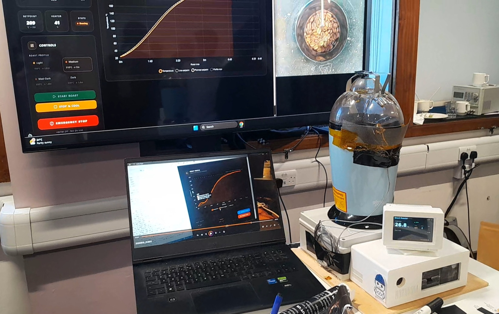
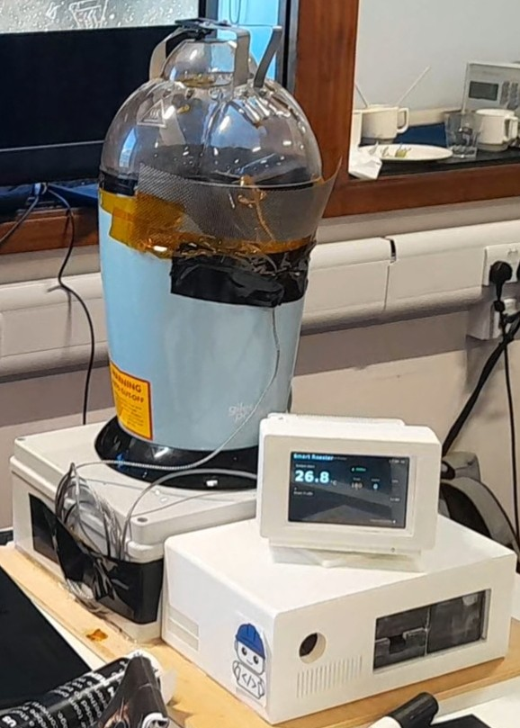
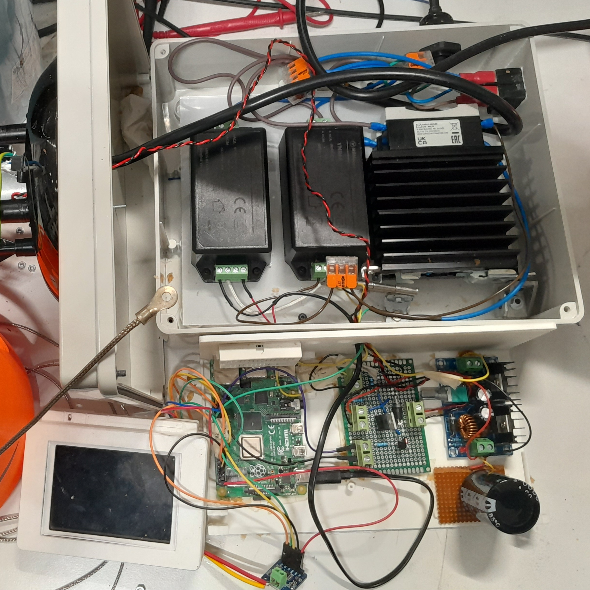
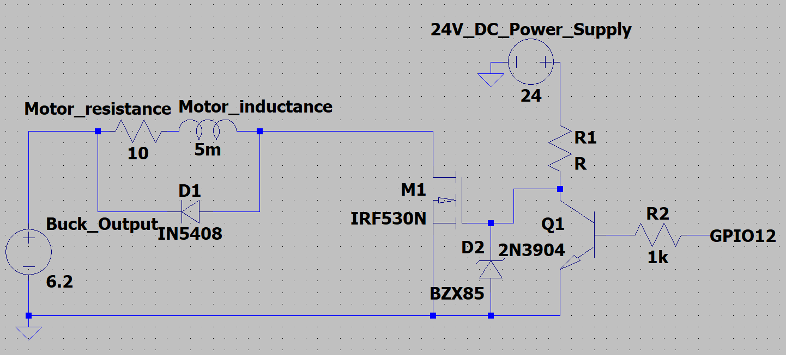
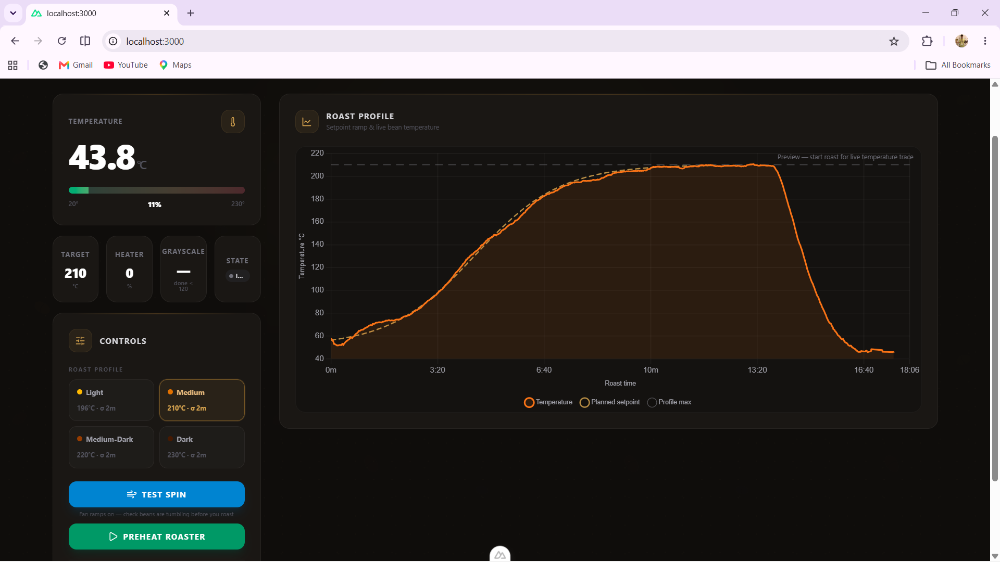

# Smart Coffee Roaster



> **A low-cost AI-enabled Smart Coffee Roaster developed as part of a third-year Electronic Engineering group project sponsored by IBM.**

The project combines **embedded systems**, **power electronics**, **control engineering**, **computer vision**, **web technologies**, and **artificial intelligence** to create an intelligent small-batch coffee roasting platform capable of automatically executing roast profiles while monitoring and logging the roasting process in real time.

---

# Table of Contents

- [Overview](#overview)
- [Project Objectives](#project-objectives)
- [Final System Features](#final-system-features)
- [Final Prototype](#final-prototype)
- [Power & Embedded Electronics Architecture](#power--embedded-electronics-architecture)
- [Control System](#control-system)
- [Dashboard](#dashboard)
- [Computer Vision & AI](#computer-vision--ai)
- [Hardware](#hardware)
- [Repository Structure](#repository-structure)
- [Detailed Backend Documentation](#detailed-backend-documentation)
- [Future Development](#future-development)
- [Team Members](#team-members)
- [Sponsor](#sponsor)
- [Disclaimer](#disclaimer)

---

# Overview

Coffee roasting is a highly dynamic thermal process where temperature, airflow and bean properties continuously change throughout the roast. Achieving consistent roast quality requires accurate temperature measurement together with precise heater and airflow control.

This project began with a commercially available **hot-air popcorn popper** before being extensively redesigned into a complete embedded coffee roasting platform.

The final system integrates:

- Adaptive Model Predictive Control (MPC)
- Automatic preheating
- Automatic bean-drop detection
- Closed-loop heater control
- Variable-speed blower control
- Live browser dashboard
- Roast profile execution
- Roast data logging
- Raspberry Pi camera monitoring
- Computer vision using grayscale analysis
- Multiple hardware and software safety systems

The primary objective of the project was to develop an accessible and low-cost coffee roasting platform capable of producing more consistent roasts while demonstrating modern embedded control techniques.

---

---

# Overall System Architecture

The Smart Coffee Roaster consists of four primary subsystems:

1. Embedded Control
2. Power Electronics
3. Computer Vision
4. User Interface

The interaction between these subsystems is shown below.

```text
                         ┌──────────────────────────┐
                         │      Web Dashboard       │
                         │  (Vue.js Frontend)       │
                         └────────────┬─────────────┘
                                      │
                            WebSocket / REST API
                                      │
                                      ▼
                         ┌──────────────────────────┐
                         │     FastAPI Backend      │
                         │     (webserver.py)       │
                         └──────┬──────────┬────────┘
                                │          │
                    Commands     │          │ Telemetry
                                ▼          ▲
                     ┌────────────────────────────┐
                     │      MPC Controller        │
                     │      (MPC_Control.py)      │
                     └──────┬────────────┬────────┘
                            │            │
                 Heater PWM │            │ Fan PWM
                            ▼            ▼
                      ┌────────┐    ┌────────┐
                      │ Heater │    │ Blower │
                      └────┬───┘    └────┬───┘
                           │             │
                           └──────┬──────┘
                                  ▼
                       ┌────────────────────┐
                       │ Coffee Roaster     │
                       │ & Roasting Chamber │
                       └─────────┬──────────┘
                                 │
                      Bean Temperature
                                 │
                                 ▼
                     ┌────────────────────┐
                     │ K-Type Thermocouple│
                     │     + MAX31855     │
                     └─────────┬──────────┘
                               │
                               ▼
                      Temperature Feedback


             ┌────────────────────────────────────────┐
             │ Raspberry Pi Camera                    │
             └────────────────┬───────────────────────┘
                              │
                              ▼
                     grayscale.py
                              │
                     Mean Grayscale
                              │
                              ▼
                     MPC Controller
```

The controller continuously receives temperature measurements from the thermocouple while simultaneously monitoring bean colour using the Raspberry Pi camera. The FastAPI backend acts as the communication layer between the embedded controller and the browser dashboard, streaming telemetry and forwarding user commands. The Adaptive Model Predictive Controller (MPC) calculates the optimum heater output every second while controlling the blower motor and logging roast data throughout the roasting process.

# Project Objectives

The objectives of this project were to:

- Design and manufacture a safe embedded coffee roasting system.
- Develop a closed-loop temperature controller capable of accurately tracking roast profiles.
- Investigate Model Predictive Control (MPC) for coffee roasting.
- Integrate computer vision for roast monitoring.
- Develop a modern browser-based user interface.
- Improve roast consistency while maintaining a low overall system cost.
- Produce a modular platform suitable for future AI-assisted roast optimisation.

---

# Final System Features

## Embedded Control

- Raspberry Pi based control system
- Closed-loop heater control
- Variable-speed blower control
- Automatic preheat sequence
- Automatic bean-drop detection
- Adaptive Model Predictive Control
- Automatic cooling mode
- Emergency stop functionality

## User Interface

- Browser-based dashboard
- Live temperature graph
- Planned roast profile
- Actual roast profile
- Roast profile presets
- Heater output display
- Fan state display
- Camera livestream
- Roast logging

## Computer Vision

- Raspberry Pi Camera integration
- Bean detection
- Region-of-interest extraction
- Mean grayscale calculation
- Roast monitoring

## Safety

- Hardware emergency stop
- Software emergency stop
- Over-temperature protection
- Fan fail-safe design
- Isolated high-voltage enclosure
- Separate low-voltage control enclosure

---

# Final Prototype



The completed prototype integrates the roasting chamber, embedded electronics, touchscreen interface, Raspberry Pi camera and browser-based dashboard into a fully functional coffee roasting system.

The Raspberry Pi continuously monitors bean temperature using a K-type thermocouple before executing the selected roast profile using an Adaptive Model Predictive Controller (MPC). Throughout the roast, telemetry is streamed to the dashboard where the user can monitor live temperature, heater output, fan state, roast progress and the camera feed.

All roast data is logged for later analysis and future controller development.

---

# Power & Embedded Electronics Architecture



To improve electrical safety and simplify maintenance, the electronics were deliberately divided into separate **high-voltage** and **low-voltage** enclosures.

This separation prevents hazardous mains wiring from being mixed with sensitive control electronics while reducing electrical interference and improving serviceability.

## High-Voltage Enclosure

The upper enclosure contains every mains-powered component used by the roasting system, including:

- AC → 24 V DC power supply for the blower motor
- AC → 5 V DC power supply for the Raspberry Pi
- Solid State Relay (SSR)
- Aluminium heatsink mounted to the SSR
- Heater switching circuitry
- Mains wiring
- Terminal blocks

The Solid State Relay allows the Raspberry Pi to safely switch the heating element while maintaining complete electrical isolation from the mains supply.

Because the SSR dissipates heat during operation, it is mounted to an aluminium heatsink to maintain safe operating temperatures during long roasting cycles.

Locating every mains-powered component inside a dedicated enclosure significantly reduces the risk of accidental contact with hazardous voltages while making the electrical system considerably easier to maintain and troubleshoot.

---

## Low-Voltage Control Enclosure

The lower enclosure contains all embedded control electronics responsible for monitoring and controlling the roasting process.

Components include:

- Raspberry Pi 4
- MAX31855 thermocouple interface
- Custom motor driver Circuit
- Raspberry Pi touchscreen display
- 24 V → 6.2 V buck converter supplying the blower motor
- Large smoothing capacitor connected to the buck converter output

The buck converter efficiently steps the 24 V supply down to approximately **6.2 V** for the blower motor.

A large output smoothing capacitor is connected across the converter output to reduce voltage ripple and improve supply stability during rapid motor load changes.

The separation between high-voltage and low-voltage electronics also improves measurement stability by reducing electrical noise reaching the thermocouple interface and Raspberry Pi.

# Custom Motor Driver



Rather than using a commercial motor driver module, a custom Circuit was designed specifically for the requirements of this project.

The driver controls the blower motor while incorporating additional hardware safety features that operate independently of the Raspberry Pi software.

## BJT Fail-Safe Design

One of the primary safety considerations during development was ensuring continuous airflow over the heater.

If the Raspberry Pi were to crash, lose power or become disconnected while the heater remained hot, stopping the blower could allow excessive temperatures to develop inside the roasting chamber.

To minimise this risk, the motor driver incorporates a **BJT-based fail-safe circuit**.

The circuit is designed so that:

- During normal operation the Raspberry Pi controls the blower speed.
- If the Raspberry Pi loses power or becomes disconnected, the control transistor automatically defaults the blower **ON**.
- Continuous airflow cools the heater while preventing excessive heat build-up inside the roasting chamber.

Unlike software safety mechanisms, this protection remains operational even if the Raspberry Pi itself has failed, providing an additional hardware layer of protection.

---

# Control System

Temperature is measured using a **K-type thermocouple** connected to a **MAX31855 thermocouple interface**.

The roasting process is controlled using an **Adaptive Model Predictive Controller (MPC)** rather than a conventional PID controller.

Coffee roasting is a challenging control problem because:

- the system exhibits significant thermal inertia,
- heater power takes several seconds to affect bean temperature,
- bean properties continuously change throughout the roast,
- moisture evaporates,
- airflow conditions vary,
- heat losses change over time.

A controller that reacts only to the current temperature error therefore struggles to accurately follow a continuously changing roast profile.

Instead, the implemented MPC predicts how the bean temperature will evolve in the future before selecting the optimum heater output.

The controller performs:

- Automatic chamber preheating
- Automatic bean-drop detection
- Future roast profile prediction
- Heater optimisation
- Adaptive thermal model updating
- Overshoot minimisation
- Smooth heater control
- Automatic cooling mode

Every second the controller:

1. Reads the current bean temperature.
2. Predicts future bean temperatures across the prediction horizon.
3. Generates the future sigmoid roast-profile setpoints.
4. Evaluates every possible heater duty cycle.
5. Calculates the optimisation cost for every candidate.
6. Selects the heater output with the minimum predicted cost.
7. Applies the selected heater duty cycle.
8. Updates the adaptive thermal model when required.

As roasting progresses, the thermal behaviour of the beans changes due to moisture evaporation, changing bean density and varying airflow conditions.

To compensate for these effects, the controller continuously adapts its thermal model by updating the heater effectiveness parameter whenever sustained prediction errors are observed.

This enables the controller to maintain accurate temperature prediction throughout the roast.

The complete mathematical derivation, optimisation equations, thermal model and implementation are documented separately in the backend documentation: [`Backend_Final_Version/README.md`](Backend_Final_Version/README.md).

---

# Dashboard



A browser-based dashboard was developed to provide complete control and monitoring of the roasting process.

The interface communicates directly with the Raspberry Pi backend using WebSockets, allowing telemetry to be updated in real time.

The dashboard displays:

- Live bean temperature
- Planned roast profile
- Actual roast profile
- Heater duty cycle
- Fan duty cycle
- Current operating state
- Camera livestream
- Roast timer
- Roast presets

The user can also:

- Start a roast
- Stop and cool the roast
- Perform an emergency stop
- Test the blower motor
- Select predefined roast profiles

All roast telemetry is continuously logged and stored for later analysis.

---

# Computer Vision & AI

A Raspberry Pi Camera continuously monitors the roasting chamber throughout the roast.

Current functionality includes:

- Live video streaming
- Bean detection
- Region-of-interest extraction
- Mean grayscale calculation
- Roast monitoring
- Roast logging

The average bean grayscale value is continuously calculated and compared against profile-dependent thresholds.

This information can be used to notify the operator when the beans appear to have reached the desired roast level.

The vision system has been deliberately separated from the main controller so that camera failures cannot interrupt heater control or other safety-critical functions.

The software architecture also allows future integration of machine learning models capable of automatically classifying roast level and recommending or terminating roasts.

---

# Hardware

The completed prototype consists of:

## Mechanical

- Modified hot-air popcorn popper
- Custom PETG blower fan
- 3D printed mechanical components
- Protective electronics enclosures

## Embedded Electronics

- Raspberry Pi 4
- Raspberry Pi Camera
- Raspberry Pi touchscreen display
- MAX31855 thermocouple interface
- K-type thermocouple
- Custom motor driver Circuit

## Power Electronics

- AC → 24 V DC power supply
- AC → 5 V DC power supply
- Solid State Relay (SSR)
- Aluminium heatsink
- 24 V → 6.2 V buck converter
- Output smoothing capacitor

---

# Repository Structure

```text
.
├── README.md                         <- Main project overview
│
├── backend_final_version/
│   ├── README.md                     <- Detailed MPC documentation
│   ├── MPC_Control.py
│   ├── grayscale.py
│   ├── webserver.py
│   ├── st7796.py
│   └── ...
│
├── blog/
│   ├── progress-update-7th-may.md
│   ├── progress-update-21st-may.md
│   └── progress-update-7th-june.md
│
├── Coffee_roaster_Product.jpg
├── Power.jpg
└── ...
```

## Detailed Backend Documentation

The backend implementation, including:

- Adaptive Model Predictive Control (MPC)
- Thermal model
- Optimisation equations
- Software architecture
- FastAPI backend
- Dashboard communication
- Camera processing
- Backend safety systems

is documented in:

**➡ `Backend_Final_Version/README.md`**

# Future Development

Although the current system is fully functional, several opportunities exist for future improvement.

Potential future work includes:

- Automatic roast completion using computer vision
- Convolutional Neural Network (CNN) based roast-level classification
- Automatic roast profile optimisation using machine learning
- Roast profile recommendation based on previous roasting data
- Multi-sensor thermal modelling
- Automatic parameter tuning for the MPC controller
- Cloud-based roast logging and analytics
- Remote monitoring and control
- Mobile application integration
- Expansion to larger-capacity roasting systems

The modular hardware and software architecture developed during this project was intentionally designed to support these future extensions with minimal modification to the existing control system.

---

# Sustainability

Coffee roasting is traditionally a highly experience-dependent process where inconsistent temperature control can result in wasted batches of coffee.

This project aims to improve sustainability by:

- Reducing roasting waste through improved temperature control
- Improving roast repeatability
- Providing an accessible low-cost roasting platform
- Supporting small-batch roasting
- Reducing unnecessary energy consumption through adaptive heater control
- Providing detailed roast data for process optimisation

The use of Model Predictive Control (MPC) further improves energy efficiency by applying only the heater power required to accurately follow the desired roast profile rather than continuously oscillating around the target temperature.

---

# Learning Outcomes

This project involved the integration of multiple engineering disciplines, including:

- Embedded Systems
- Control Engineering
- Power Electronics
- Software Engineering
- Computer Vision
- Mechanical Design
- 3D Printing
- Data Logging
- Web Development

The final prototype demonstrates the successful integration of these disciplines into a complete embedded coffee roasting platform.

---

# Project Outcome

The project successfully produced a fully operational AI-enabled smart coffee roaster capable of:

- Automatic preheating
- Automatic bean-drop detection
- Closed-loop temperature control
- Adaptive Model Predictive Control
- Roast profile tracking
- Live dashboard monitoring
- Camera-based roast monitoring
- Roast logging
- Automatic cooling
- Hardware and software safety mechanisms

Multiple successful roasting trials were completed throughout the project, demonstrating accurate temperature tracking and repeatable roast profile execution.

The completed system provides a modular platform suitable for continued research into intelligent coffee roasting and future AI-assisted optimisation techniques.

---

# Team Members

This project was completed by:

- Sami Marouf
- Tayo Babs-Olugbemi
- Rojan Ragunathan
- Patanwit Sawatyanon
- Yikai Su
- Peter Z Wang

---

# Sponsor

This project was completed as part of a third-year Electronic Engineering Group Design Project with sponsorship and support from **IBM**.

IBM provided industrial guidance throughout the project, helping shape the system requirements, design process and final implementation.

---

# Acknowledgements

The team would like to thank:

- IBM for sponsoring and supporting the project.
- The Department of Electronic Engineering for providing laboratory facilities and technical guidance.
- The project supervisors and demonstrators for their continuous feedback throughout the design and testing process.

---

# Disclaimer

This project interfaces with **mains electricity**, **high temperatures**, and **moving mechanical components**.

The prototype was developed for educational and research purposes.

Although numerous hardware and software safety mechanisms were incorporated—including electrical isolation, emergency stop functionality, over-temperature protection, hardware blower fail-safe circuitry and automatic cooling—the system should only be operated using appropriate electrical protection and under suitable supervision.

The authors accept no responsibility for any damage or injury resulting from attempts to reproduce or operate this system without appropriate engineering knowledge and safety precautions.

---

# Detailed Backend Documentation

The complete backend implementation—including:

- Adaptive Model Predictive Control (MPC)
- Mathematical derivation of the controller
- Thermal process model
- Optimisation cost function
- Adaptive thermal model
- FastAPI backend
- Dashboard communication
- Camera processing pipeline
- Safety mechanisms
- Backend architecture

is documented separately in:

## ➜ **[`Backend_Final_Version/README.md`](Backend_Final_Version/README.md)**

This document provides a detailed explanation of the control algorithms, mathematical equations, software architecture and implementation used by the Smart Coffee Roaster.